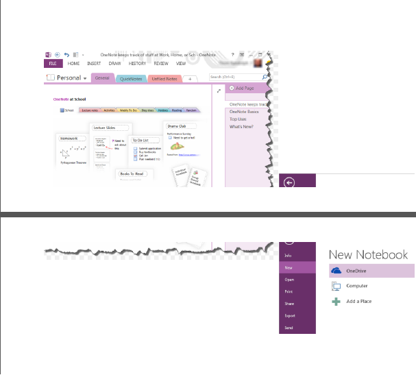
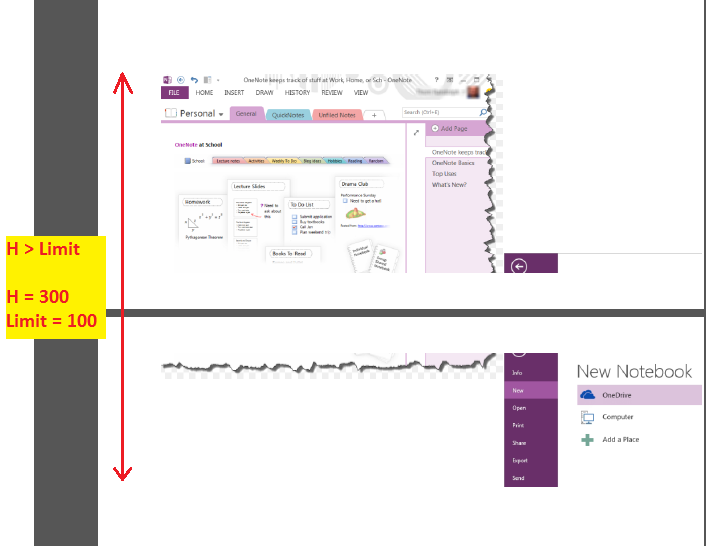
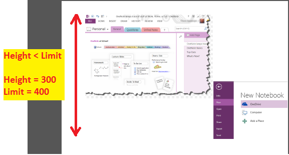
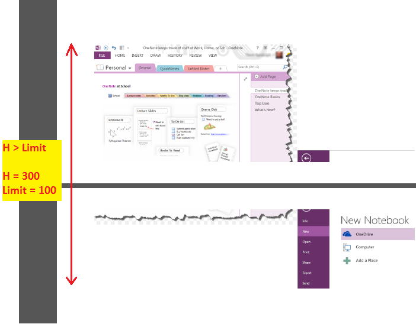
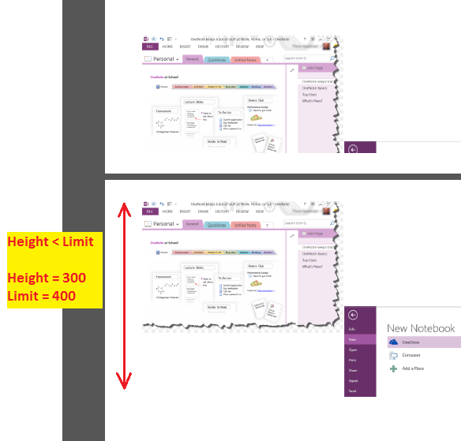

## **Loading OneNote Documents**
The Document class exposed by the OneNote Java API or library can be used to load Microsoft OneNote .One file format files. The following sample code in Java programming language shows the usage of this class for loading a Microsoft OneNote document.


## **Increase Performance for Consequent Export Operations**
Aspose.Note API allows increasing performance for consequent export operations. Users may involve in multiple conversions to several supported formats. In such scenarios, the performance is the highly affecting factor.

Aspose.Note for Java offers the [Document](https://reference.aspose.com/note/java/com.aspose.note/Document) class that represents a OneNote file. The Document class exposes the AutomaticLayoutChangesDetectionEnabled property and DetectLayoutChanges method, their combined use enable users to disable automatic detection of layout changes and handle them manually:


## **Working with Password Protected OneNote Documents**
{} 

Aspose.Note API allows to load password-protected OneNote documents. The API's LoadOptions class provides the setDocumentPassword method to specify the document password.

{} 
### **Creating Password Protected OneNote Documents**
Aspose.Note API allows to set password for the document while saving OneNote documents. The setDocumentPassword method exposed by OneSaveOptions class provides the capability to password protect a document.



### **Loading Password Protected OneNote Documents**
A password-protected OneNote document can be loaded using the following steps:

1. Create a new object of LoadOptions class
1. Specify the password of the document using the setDocumentPassword method
1. Load the document with the defined object of the LoadOptions class




## **Setting Page Splitting Algorithm**
While converting a OneNote document to other formats, images and other contents may get disturbed due to their position in the document. Thus, it is necessary to specify some methods to split a page. The PdfSaveOptions.PageSplittingAlgorithm property provides different options to specify an algorithm of page splitting. These options are:

- **AlwaysSplitObjectsAlgorithm** - Splits objects into several parts at pages' bottom position.
- **KeepPartAndCloneSolidObjectToNextPageAlgorithm** - Adds objects up to the bottom of the page and clone full object to the next page in case it doesn't fit in the original page.
- **KeepSolidObjectsAlgorithm** - Shifts full object to the next page in case it doesn't fit in the original page.

The default algorithm is **KeepSolidObjectsAlgorithm**.
### **Using the Splitting Algorithm Method**


For KeepPartAndCloneSolidObjectToNextPageAlgorithm and KeepSolidObjectsAlgorithm, the maximum possible height of an object plays a role that can be cloned to the next page. In case an object cannot be cloned, it will be split using AlwaysSplitObjectsAlgorithm. Use the constructor parameter to change this limit as shown below:



#### **KeepSolidObjectsAlgorithm**
\1. The limit was exceeded and images were split on the pages joint.



\2. The limit is sufficient and images were completely cloned to the next page.



#### **KeepPartAndCloneSolidObjectToNextPageAlgorithm**
\1. The limit was exceeded and images were split into the pages joint.



\2. The limit is sufficient and images were partially added to the first page and completely cloned to the next page.



#### **AlwaysSplitObjectsAlgorithm**
Images were split into the pages joint.

