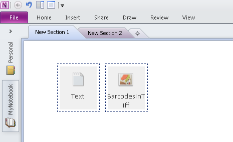

## **Retrieve Attached Files from a OneNote Document**
All files attached to a Microsoft OneNote document can be retrieved. These files are stored in AttachedFile nodes. The AttachedFile class represents an attached file.

**A OneNote file displaying attached files** 

To extract all attached files from a OneNote document, follow these steps:

1. Use the [Document](https://reference.aspose.com/note/java/com.aspose.note/Document).getChildNodes method to select all AttachedFile nodes.
1. Iterate through the resulting node collections.
1. Extract image bytes array using the AttachedFile.Bytes property.
1. Save the attached file bytes to the local space.

This example shows how to extract attached files from a OneNote document and save them to local space.


## **Attach a File to the OneNote Document**
To keep a copy of any document or file as part of the OneNote document, developers can attach it to the OneNote page. The AttachedFile class represents an attachment file.

To attach a file to a OneNote document, follow these steps:

1. Use the Document class to generate the OneNote file.
1. Initialize Page, OutlineElement and Outline classes by passing document object.
1. Initialize AttachedFile object by passing the document object and file path.
1. Add an attached file node under the OutlineElement node.
1. Save a OneNote document.
### **Attach File by Passing its Path**
This example shows how to attach a file to a OneNote document.


### **Attach File and Set its Icon by Passing Files Path**
This example shows how to attach a file and also set an attach file icon in the OneNote document.

