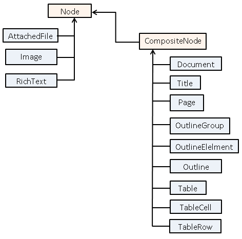

## **Extract OneNote Content using DocumentVisitor**
{} 

Aspose.Note can be used to parse Microsoft Office OneNote documents to extract separate document elements such as pages, images, rich text, outline, title, table, attached files, and others. Another possible task is to find all text and get a total count of nodes etc.

{} 

Use the [DocumentVisitor](https://reference.aspose.com/note/java/com.aspose.note/DocumentVisitor) class to implement this usage scenario. This class corresponds to the well-known Visitor design pattern. With the DocumentVisitor, you can define and execute custom operations that require enumeration over the document tree.

DocumentVisitor provides a set of VisitXXX methods that are invoked when a particular document element (node) is encountered. For example, [DocumentVisitor.VisitRichTextStart](https://reference.aspose.com/note/java/com.aspose.note/DocumentVisitor#visitRichTextStart-com.aspose.note.RichText-) is called when the text item starts and [DocumentVisitor.VisitImageEnd](https://reference.aspose.com/note/java/com.aspose.note/DocumentVisitor#visitImageEnd-com.aspose.note.Image-) is called when the visitor has visited all the children nodes. Each DocumentVisitor.VisitXXX method accepts the corresponding object that it encounters so you can use it as needed.

These are the steps you should follow to programmatically determine and extract various parts of a document:

1. Create a class derived from DocumentVisitor.
1. Override and provide implementations for some or all of the DocumentVisitor.VisitXXX methods to perform custom operations.
1. Call [Node.Accept]https://reference.aspose.com/note/java/com.aspose.note/node#accept-com.aspose.note.DocumentVisitor) on the node from where you want to start the enumeration. For example, if you want to enumerate the whole document, use [Document.Accept](https://reference.aspose.com/note/java/com.aspose.note/Document#accept-com.aspose.note.DocumentVisitor-).

DocumentVisitor provides default implementations for all of the DocumentVisitor.VisitXXX methods. This makes it easier to create new document visitors as only the methods required for the particular visitor need to be overridden. It is not necessary to override all of the visitor methods.

This example shows how to use the Visitor pattern to add new operations to the Aspose.Note object model. In this case, we create a simple document converted into a text format.


## **Aspose.Note Document Object Model**
### **Node Classes**
When Aspose.Note reads a OneNote document into memory, objects of different types are created to represent various document elements. Every RichText of text, title, table, and even the OneNote itself is a node. Aspose.Note defines a class for every type of document node.
The following illustration is a UML class diagram that shows inheritance between node classes of the Aspose.Note Document Object Model (DOM). The names of abstract classes are Node and CompositeNode. Please note that the Aspose.Note DOM also contains non-node classes such as [ParagraphStyle](https://reference.aspose.com/note/java/com.aspose.note/ParagraphStyle), [Margins](https://reference.aspose.com/note/java/com.aspose.note/Margins), [NumberList](https://reference.aspose.com/note/java/com.aspose.note/NumberList)**,** etc that do not participate in the inheritance and they are not shown on this diagram.

The following table lists Aspose.Note node classes and their short descriptions.

|**Aspose.Note Class**|**Category**|**Description**|
| :- | :- | :- |
|[Document](https://reference.aspose.com/note/java/com.aspose.note/Document)|Document|A document object that, as the root of the document tree, provides access to the entire OneNote document.|
|[Title](https://reference.aspose.com/note/java/com.aspose.note/Title)|Title|A page title of OneNote document.|
|[Page](https://reference.aspose.com/note/java/com.aspose.note/Page)|Page|A page of OneNote document.|
|[AttachedFile](https://reference.aspose.com/note/java/com.aspose.note/AttachedFile)|File|Represents an attached file within the OneNote document.|
|[Image](https://reference.aspose.com/note/java/com.aspose.note/Image)|Image|Represents an image file within the OneNote document.|
|[OutlineGroup](https://reference.aspose.com/note/java/com.aspose.note/OutlineGroup)|Outline|Represents a group of outlines.|
|[OutlineElement](https://reference.aspose.com/note/java/com.aspose.note/OutlineElement)|Outline|Represents an outline element.|
|[Outline](https://reference.aspose.com/note/java/com.aspose.note/Outline)|Outline|Represents an outline.|
|[Table](https://reference.aspose.com/note/java/com.aspose.note/Table)|Tables|A table in a OneNote document.|
|[TableCell](https://reference.aspose.com/note/java/com.aspose.note/TableCell)|Tables|A cell of a table row.|
|[TableRow](https://reference.aspose.com/note/java/com.aspose.note/TableRow)|Tables|A row of a table.|
|[RichText](https://reference.aspose.com/note/java/com.aspose.note/RichText)|Text|A RichText of text with consistent formatting.|
{} 

The following table lists Aspose.Note base node classes that help to form the class hierarchy.

{} 

|**Class**|**Description**|
| :- | :- |
|[Node](https://reference.aspose.com/note/java/com.aspose.note/Node)|Abstract base class for all nodes of a OneNote document. Provides basic functionality of a child node.|
|[CompositeNode](https://reference.aspose.com/note/java/com.aspose.note/CompositeNodeBase)|Base class for nodes that can contain other nodes. Provides operations to access, insert, remove and select child nodes.|
#### **Distinguish Nodes by NodeType**

Although the class of the node is sufficient enough to distinguish different nodes from each other, Aspose.Note provides the NodeType enumeration to simplify some API tasks such as selecting nodes of a specific type. The type of each node can be obtained using the [NodeType ](https://reference.aspose.com/note/java/com.aspose.note/NodeType)enumeration. This returns a **NodeType** enumeration value. For example, a RichText node (represented by the **RichText** class) returns [NodeType.RichText](https://reference.aspose.com/note/java/com.aspose.note/RichText), a table node (represented by the **Table** class) returns [NodeType.Table](https://reference.aspose.com/note/java/com.aspose.note/NodeType), and so on.
## **Create an Empty OneNote Document with a Page Title**
Aspose.Note for Java supports generating OneNote documents from scratch.

Use this code snippet to create from scratch a new document with a title.

This example works as follows:

1. Create an object of the Document class.
1. Initialize Page class object by passing the Document class object.
1. Set Page title using Page.setTitle() method.
1. Call Document class' appendChildLast method and pass the Page class object.
1. Finally, save it by calling the save method of Document class.

The following code snippet shows you how to create an empty OneNote document with a page title.


## **Getting File Format Information**
Aspose.Note API supports Microsoft OneNote as well as on OneNote online file formats. The lateral has some limitations such as no support for attachments and images in the document is not available. In order to guide the users about these two different types of documents, the API provides the method to determine the file format of the OneNote document so as to know the limitations until these are fully supported.

This article shows how to retrieve the file format information of the OneNote document using the FileFormat property of the Document class.


