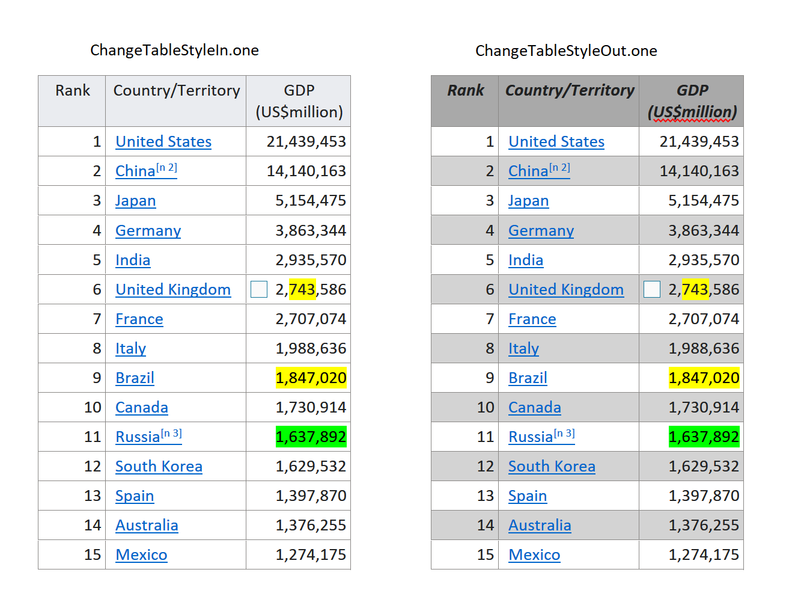

## **Extracting Plain Text from the Table of OneNote Document**
Aspose.Note for JAVA offers the [Document](https://apireference.aspose.com/note/java/com.aspose.note/document) class that represents a OneNote file. The Document class exposes the getChildNodes method that can be called to extract table nodes from a OneNote document.

This article shows how to:

- [Get table text from a OneNote document](/note/java/working-with-tables/#get-table-text-from-onenote-document).
- [Get row text from a table in a OneNote document](/note/java/working-with-tables/#get-row-text-from-a-table-in-a-onenote-document).
- [Get cell text from a row in a table](/note/java/working-with-tables/#get-cell-text-from-a-row-in-a-table).
### **Get Table Text from OneNote Document**
This example works as follows:

1. Create an object of the Document class.
1. Call getChildNodes method of the Document class.
1. Retrieve a list of table nodes.
1. Call the stream-based code to extract text.
1. Display text on the output screen.

The following example shows how to get table text from a OneNote document.



### **Get Row Text from a Table in a OneNote Document**
This example works as follows:

1. Create an object of the Document class.
1. Filter out a list of table nodes.
1. Iterate through table rows.
1. Call the stream-based code to extract text.
1. Display the text on the output screen.

The following example shows how to extract row text from a table in a OneNote document.



### **Get Cell Text from a Row in a Table**
This example works as follows:

1. Create an object of the Document class.
1. Filter out a list of table nodes.
1. Iterate through the table rows.
1. Filter out a list of cell nodes from each row.
1. Iterate through the row cells.
1. Call the stream-based code to extract text.
1. Display the text on the output screen.

The following example shows how to get cell text from a row of the table.


## **Insert a Table in OneNote Document**
Aspose.Note for Java APIs allows developers to insert a table at a particular node position. This article is meant to show you how to create a table in OneNote document programmatically.

Aspose.Note for Java offers the Document class that represents a OneNote file. Developers can append content under the TableCell node, table cells to the TableRow node, table row to the Table node. Later they could append table under OutlineElement node, outline element to Outline node, outline to Page node and then a page to the Document node. It's all based on the **Aspose.Note DOM structure**.

The following example shows how to insert a table in a OneNote document.


## **Create a Table with Locked Columns in the OneNote Document**
Aspose.Note for Java APIs allows developers to insert a table at a particular node position. This article is meant to show you how to create a table with a locked column in OneNote document programmatically.

Aspose.Note for Java offers the Document class that represents a OneNote file. Developers can append content under the TableCell node, table cells to the TableRow node, table row to the Table node. LockedWidth property of the Table class allows bolting its width. Later they could append table under OutlineElement node, outline element to Outline node, outline to Page node and then a page to the Document node. It's all based on the **Aspose.Note DOM structure**.

The following example shows how to insert a table with locked columns in a OneNote document.


## **GetOutlineElementWithText Method**

## **Setting Cell Background Color**

## **Changing style of a table**


