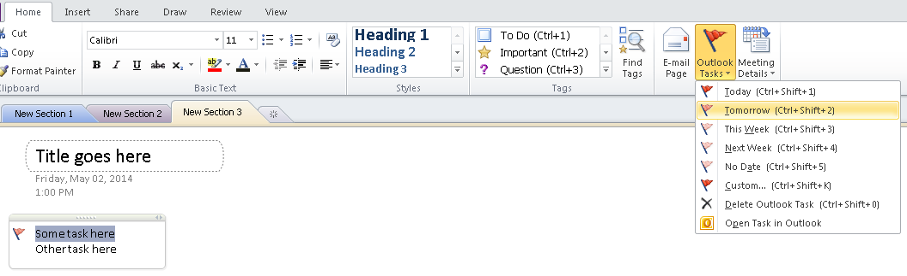

## **Get Outlook Task Details from a OneNote Document**
{} 

The NoteTask class provides all the properties related to a Microsoft OneNote document's Outlook tasks. All the file's Outlook tasks are contained by RichText nodes in the [Document](https://apireference.aspose.com/note/java/com.aspose.note/Document) object.

{} 
### **Get Outlook Task Details**
**A OneNote file displaying an Outlook task** 

The code below shows how to get details about each Outlook task from a OneNote document.


