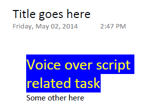
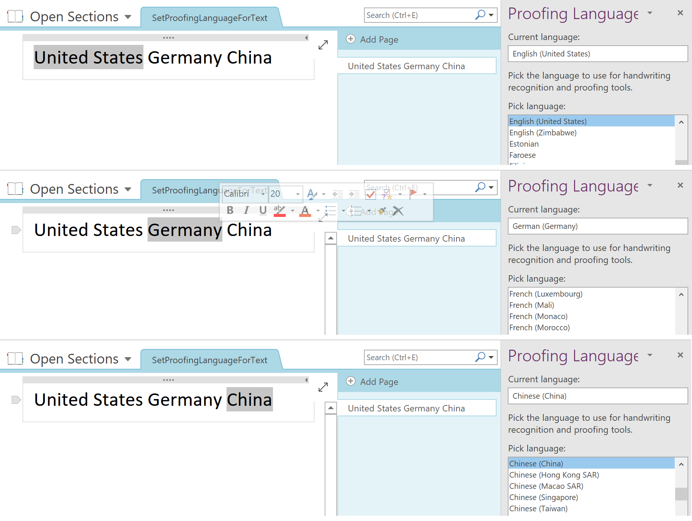

## **Change the Font Color, Size and Highlight All the Text of RichText Node**
{} 

This topic discusses changing the font color, size and highlighting all the text of a RichText node. This feature provides more in-depth control of OneNote to developers. Using this feature, developers can customize the font color, size and highlight text of any desired rich text node.

{} 
### **Changing the Font Color, Size & Highlighting the Text**
To change the font and color of a rich text node using Aspose.Note, please follow the steps below:

1. Load OneNote document to a [Document](https://reference.aspose.com/note/java/com.aspose.note/Document) class.
1. Access a RichText node whose font and colors are to be changed.
1. Access TextStyle.
1. Set the text's font and color.

The output of the code snippet below is shown in the figure.

### **Change style of the paragraph.**

### **Set default paragraph style settings.**


The output file looks like:

### **Set proofing language for a text.**


The output file looks like:

