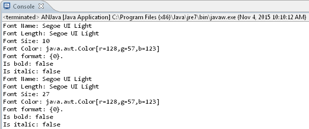

## **Extract Text from OneNote Document**
{} 

One of the tasks that developers need to perform is extracting text from a OneNote document. [Aspose.Note for Java](https://products.aspose.com/note/java/) allows developers to extract text from a OneNote document in various ways.

{} 

Aspose.Note for Java offers the [Document](https://reference.aspose.com/note/java/com.aspose.note/Document) class that represents a OneNote file. The Document class exposes the GetText method that can be called to extract text from a OneNote document.

This article shows how to:

- [Extract all text from OneNote document](/note/java/working-with-text/#extracting-all-text-from-onenote-document).
- [Extract text from a specified page of OneNote document](/note/java/working-with-text/#extracting-text-from-a-specified-page-of-a-onenote-document).
### **Extracting All Text from OneNote Document**
This example works as follows:

1. Create an object of the Document class.
1. Call the stream-based code to extract text.
1. Display text on the output screen.

The following example shows how to extract all text from a OneNote document.


### **Extracting Text from a Specified Page of a OneNote Document**
This example works as follows:

1. Create an object of the Document class.
1. Filter out a list of page nodes.
1. Retrieve the page node by index.
1. Call the stream-based code to extract text.
1. Display the text on the output screen.

The following example shows how to extract text from a specified page in a OneNote document.


## **Replace Text in Pages of a OneNote Document and Save as PDF**
Aspose.Note for Java supports finding and then replacing text within a OneNote document.

Aspose.Note for Java offers the [Document](https://reference.aspose.com/note/java/com.aspose.note/Document) class that represents a OneNote file.

This article shows how to:

- [Replace text on all pages](/note/java/working-with-text/#replace-text-on-all-pages).
- [Replace text on a particular page](/note/java/working-with-text/#replace-text-on-a-particular-page).
### **Replace Text on All Pages**
The following example shows how to replace text on all pages.


### **Replace Text on a Particular Page**
The following example shows how to replace text on a particular page.


## **Retrieve Bullet or Number List Properties**
Aspose.Note for Java provides comprehensive support for Microsoft OneNote lists. Developers can access a number of list properties, such as font name, numbering format, and many others.
### **Retrieving Properties**
Aspose.Note for .NET offers the [OutlineElement](https://reference.aspose.com/note/java/com.aspose.note/OutlineElement) class that represents an outline inside a OneNote document. The OutlineElement class exposes the NumberList property that can be called to extract bullet or numbered list properties. The following example shows how to extract bullet or numbered list properties from a OneNote document.

**Output Screen** 


## **Apply Bullets on the Text**
Arranging texts in bullet form is a very common approach. Aspose.Note for Java API allows developers to arrange text items in bullets.

Aspose.Note for Java offers the [Document](https://reference.aspose.com/note/java/com.Aspose.Note.Document Class) class that represents a OneNote file. Writing text to a OneNote document page involves creating an [OutlineElement](https://reference.aspose.com/note/java/com.aspose.note/OutlineElement), which offers NumberList property to define the bullet.

Please see a brief description to add and apply bullets on the text in OneNote document using the Aspose.Note APIs:

1. Create an instance of the [Document](https://reference.aspose.com/note/java/com.aspose.note/Document) class that represents a OneNote document.
1. Initialize three objects of [Page](https://reference.aspose.com/note/java/com.aspose.note/Page) class and set their levels.
1. Initialize the objects of [Outline](https://reference.aspose.com/note/java/com.aspose.note/Outline), [OutlineElement](https://reference.aspose.com/note/java/com.aspose.note/OutlineElement) and [RichText](https://reference.aspose.com/note/java/com.aspose.note/RichText) classes. 
   Setting the NumberList property of the [OutlineElement](https://reference.aspose.com/note/java/com.aspose.note/OutlineElement) class adds bullets.
1. The [ParagraphStyle](https://reference.aspose.com/note/java/com.aspose.note/ParagraphStyle) class defines the text formatting.
1. Generate the OneNote document by calling the Save method of the [Document](https://reference.aspose.com/note/java/com.aspose.note/Document) object.

The following example shows how to apply a bullet on the OneNote document.


## **Apply Numbering on the Text**
Arranging texts in numbering form is a very common approach. Aspose.Note for Java API allows developers to arrange text items in numbering.

Aspose.Note for Java offers the [Document](https://reference.aspose.com/note/java/com.aspose.note/Document) class that represents a OneNote file. Writing text to a OneNote document page involves creating an [OutlineElement](https://reference.aspose.com/note/java/com.aspose.note/OutlineElement), which offers NumberList property to define the bullet.

Please see a brief description to add and apply bullets on the text in OneNote document using the Aspose.Note APIs:

1. Create an instance of the [Document](https://reference.aspose.com/note/java/com.aspose.note/Document) class that represents a OneNote document.
1. Initialize three objects of [Page](https://reference.aspose.com/note/java/com.aspose.note/Page) class and set their levels.
1. Initialize the objects of [Outline](https://reference.aspose.com/note/java/com.aspose.note/Outline), [OutlineElement](https://reference.aspose.com/note/java/com.aspose.note/OutlineElement) and [RichText](https://reference.aspose.com/note/java/com.aspose.note/RichText) classes. 
   Setting the NumberList property of the [OutlineElement](https://reference.aspose.com/note/java/com.aspose.note/OutlineElement) class adds bullets.
1. The [ParagraphStyle](https://reference.aspose.com/note/java/com.aspose.note/ParagraphStyle) class defines the text formatting.
1. Generate the OneNote document by calling the Save method of the [Document](https://reference.aspose.com/note/java/com.aspose.note/Document) object.

The following example shows how to apply a bullet on the OneNote document.


## **Insert Chinese Number List in the OneNote Document**
[Aspose.Note for Java API](https://products.aspose.com/note/java/) supports inserting the Chinese number list in the OneNote document.

Aspose.Note for Java offers the [Document](https://reference.aspose.com/note/java/com.aspose.note/Document) class that represents a OneNote file. Inserting the Chinese number list to a OneNote document page involves creating an [OutlineElement](https://reference.aspose.com/note/java/com.aspose.note/OutlineElement), which offers NumberList property to define the bullet.

Please see a brief description to add and apply bullets on the text in OneNote document using the Aspose.Note APIs:

1. Create an instance of the [Document](https://reference.aspose.com/note/java/com.aspose.note/Document) class that represents a OneNote document.
1. Initialize three objects of [Page](https://reference.aspose.com/note/java/com.aspose.note/Page) class and set their levels.
1. Initialize the objects of [Outline](https://reference.aspose.com/note/java/com.aspose.note/Outline), [OutlineElement](https://reference.aspose.com/note/java/com.aspose.note/OutlineElement) and [RichText](https://reference.aspose.com/note/java/com.aspose.note/RichText) classes. 
   Setting the NumberList property with Chinese counting format of the [OutlineElement](https://reference.aspose.com/note/java/com.aspose.note/OutlineElement) class adds bullets.
1. The [ParagraphStyle](https://reference.aspose.com/note/java/com.aspose.note/ParagraphStyle) class defines the text formatting.
1. Generate the OneNote document by calling the Save method of the [Document](https://reference.aspose.com/note/java/com.aspose.note/Document) object.

The following example shows how to apply a bullet on the OneNote document.


## **Creating Page Title in MS OneNote Style**
Aspose.Note API allows creating a page tile in default MS OneNote Style. The DefaultMsOneNoteTitleParagraphStyle property of the ParagraphStyle class can be used to set the page title for this purpose.
### **Setting Page Title in Microsoft OneNote Style**

