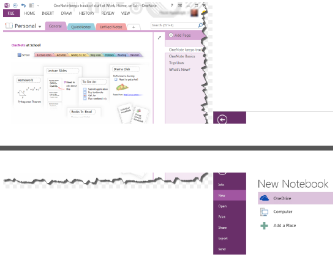

{} 

Aspose.Note API supports loading Microsoft.Note documents using its Document Object Model. It supports loading Microsoft OneNote 2010, 2013 and OneNote Online (SharePoint) file formats. It provides support for .one as well as .onetoc2 file formats.

{} 
## **Create a OneNote and Save into HTML Format**
Aspose.Note supports creating a OneNote file and then saving it into HTML file format. To use this feature, import the Aspose.Note.Saving namespace into your application project. It has numerous valuable classes for rendering, for example, HtmlSaveOptions, ImageSaveOptions, PdfSaveOptions, and SaveOptions.

Aspose.Note for .NET offers the [Document](https://apireference.aspose.com/note/net/aspose.note/document) class that represents a OneNote file. The Document class exposes the Save method that can be called to convert the OneNote file into the HTML file format. The [HtmlSaveOptions](https://apireference.aspose.com/note/net/aspose.note.saving/htmlsaveoptions) class provides options for creating HTML file, such as PageIndex, PageCount, SaveFormat and others.
### **Creating a OneNote Document and Saving into HTML using the Default Options**
The following code example demonstrates how to create a OneNote and save into the HTML using the default options.


### **Creating a OneNote Document and Saving a Page Range into HTML**
The following code example demonstrates how to create a OneNote and save a page range into HTML using the HtmlSaveOptions class. It sets the PageCount and PageIndex properties.


### **Save to Memory Stream with Embedded Resources**

### **Save to Memory Stream with Callbacks**


The above sample will require the following class for execution.


### **Save as HTML File with Resources In Separate File**

## **Loading OneNote Documents**
The Document class exposed by the API can be used to load Microsoft OneNote .one file format files. The following code example demonstrates the usage of this class for loading a Microsoft OneNote document.


## **Increase Performance for Consequent Export Operations**
[Aspose.Note for .NET APIs](http://www.aspose.com/.net/onenote-component.aspx) allow to increase performance for consequent export operations. Users may involve in multiple conversions to several supported formats. In such scenarios, the performance is the highly affecting factor.

Aspose.Note for .NET offers the [Document](https://apireference.aspose.com/note/net/aspose.note/document) class that represents a OneNote file. The Document class exposes the AutomaticLayoutChangesDetectionEnabled property and DetectLayoutChanges method, their combine use enable users to disable automatic detection of layout changes and handle them manually:


## **Working with Password Protected OneNote Documents**
### **Creating Password Protected OneNote Documents**

### **Loading Password Protected OneNote Documents**
Aspose.Note API allows to load a password-protected OneNote documents. The API's LoadOptions class provides the DocumentPassword property to specify the document password.
A password-protected OneNote document can be loaded using the following steps:

1. Create a new object of LoadOptions class
1. Specify the password of the document using the DocumentPassword property
1. Load the document with the defined object of the LoadOptions class


## **Setting Page Splitting Algorithm**
While converting a OneNote document to other formats, images and other contents may get disturbed due to their position in the document. Thus, it is necessary to specify some methods to split the page. The PdfSaveOptions.PageSplittingAlgorithm property provides different options to specify an algorithm of page splitting. These options are:

- AlwaysSplitObjectsAlgorithm - Splits objects into several parts at pages' bottom position.
- KeepPartAndCloneSolidObjectToNextPageAlgorithm - Adds objects up to the bottom of the page and clones full object to the next page in case it doesn't fit in the original page.
- KeepSolidObjectsAlgorithm - Shifts full object to the next page in case it doesn't fit in the original page.

The default algorithm is KeepSolidObjectsAlgorithm.
### **Using the KeepSOlidObjectsAlgoirthm**


For KeepPartAndCloneSolidObjectToNextPageAlgorithm and KeepSolidObjectsAlgorithm, the maximum possible height of an object plays a role that can be cloned to the next page. In case an object cannot be cloned, it will be split using AlwaysSplitObjectsAlgorithm. Use the constructor parameter to change this limit as shown below:


#### **KeepSolidObjectsAlgorithm**
\1. The limit was exceeded and images were split on the pages joint.



\2. The limit is sufficient and images were completely cloned to the next page.



#### **KeepPartAndCloneSolidObjectToNextPageAlgorithm**
\1. The limit was exceeded and images were split into the pages joint.



\2. The limit is sufficient and images were partially added to the first page and completely cloned to the next page.



#### **AlwaysSplitObjectsAlgorithm**
Images were split into the pages joint.

