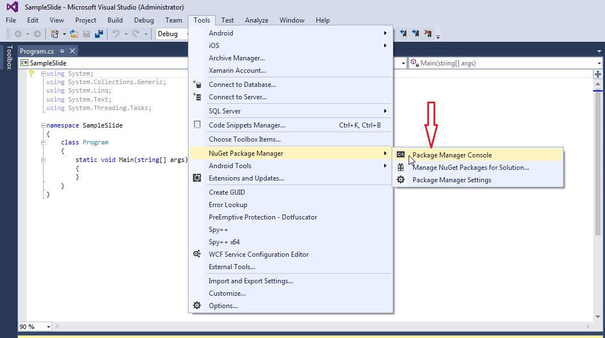
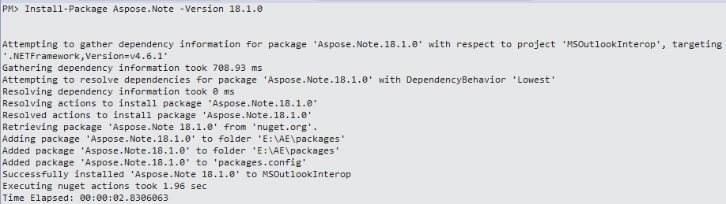
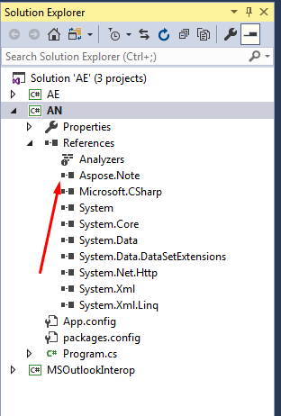

## **Installing Aspose.Note for .NET through NuGet**
NuGet is the easiest way to download and install Aspose APIs for .NET. Open Microsoft Visual Studio and NuGet package manager. Search "aspose" to find the desired Aspose API. Click on "Install", the selected API will be downloaded and referenced in your project.
## **Install or Update Aspose.Note using the Package Manager Console**
You can follow the steps below to reference the Aspose.Note API using the package manager console:

1. Open your solution/project in Visual Studio.
1. Select Tools -> Library Package Manager -> Package Manager Console from the menu to open package manager console.

Type the command “**Install-Package Aspose.Note -Version x.x.0**” and press the enter button to install latest full release into your application. Alternatively, you can add the "**-prerelease**" suffix to the command in order to specify that the latest release including hotfixes is to be installed as well.

If you are not familiar with the [Aspose EULA](http://www.aspose.com/corporate/purchase/end-user-license-agreement.aspx) then it is a good idea to read the license referenced in the URL. 

You should now find that Aspose.Note has successfully been added and referenced in your application for you.

In the package manager console, you can also use the command “**Update-Package Aspose.Note.NET**” and press enter to check for any updates to the Aspose.Note package and install them if present. You can also add the "-prerelease" suffix to update the latest release.
## **Uninstalling Aspose.Note for .NET**
If you have used the MSI installer to deploy Aspose.Note for .NET, follow these steps to completely remove the component and controls, associated demos and documentation:

1. From the **Start** menu, select **Settings**, followed by **Control Panel**.
1. Click **Add/Remove Programs**.
1. Select **Aspose.Note for .NET (version)**.
1. Click **Change/Remove** to remove Aspose.Note.
## **Referencing Aspose.Note from a .NET Project**
In order to use Aspose.Note in an application, add a reference to it. The process described in this article assumes that you're using Visual Studio.

To add a reference using Visual Studio:

1. In the Solution Explorer, expand the project node you want to add a reference to.
1. Right-click the References node for the project and select **Add Reference** from the menu.
1. In the Add Reference dialog box, select the **Browse** tab.
1. Click **Browse** and locate Aspose.Note binary.
1. Select it and click **Add**.
1. Click **OK**.

The Aspose.Note reference appears under the References node of the project.
### **Referencing the API from a VS.NET 2012 Client Profile project**
If your project's target framework is .NET Framework 4 Client Profile, use the **Aspose.Note.dll** file located in the NET40cp folder of the installation directory.

For example:

1. In Solution Explorer of VS.NET 2012 for your project, right-click **References** and select **Add Reference**.
1. Select the **Browse** tab in the dialog and use the search box.
1. Find and select the Aspose.Note.dll binary file in the installation directory, for example: .../Program Files (x86)/Aspose/Aspose.Note for .NET/Bin/NET40cp/
   Make sure that you installed the product using the MSI installer on your machine.
1. Click **OK** to close the dialog box.

{} 

If your VS.NET 2012 project's target framework is .NET Framework 4 or other, then simply use the Aspose.Note.dll binary file located in **NET2.0** folder.

{}
